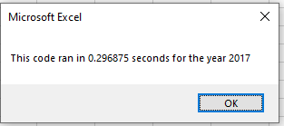

# VBA of Wall Street

## Overview of Project

#### This project had two purposes: 1. To gain experience with VBA and Excel and 2. To analyse the Wall Street data to give Steve some insight on some green stocks for his parents investments. The new VBA experience showed how to refactor code to make it more efficient and automated.

## Results

#### The data for these analyses are a list of Stock Tickers with daily values for Open, High, Low, Close, and Volume for 2017 and 2018. Steve wants to get some aggregated data for all stocks to compare the performance. 

#### The data for these analyses are lists of Stock Tickers with daily values for Open, High, Low, Close, and Volume for 2017 and 2018. Steve wants to get some aggregated data for all stocks to compare the performance of various green stocks. The analyses used refactored code from the Module 2 steps. The performance time between years and code versions is also compared.

### The macro AllStocksAnalysisRefactored() utilized Cell assignments to create the table for the results. The complete VBA code is included VBA_Challenge.vbs file in the GitHub repository. Below are code snippets examples for new techniques and refactoring.

```VB
    Worksheets("All Stocks Analysis").Activate
    
    Range("A1").Value = "All Stocks (" + yearValue + ")"
    
    'Create a header row
    Cells(3, 1).Value = "Ticker"
    Cells(3, 2).Value = "Total Daily Volume"
    Cells(3, 3).Value = "Return"
```
### Arrays were used to hold all the ticker stock abbreviations as well as the total volume and starting and ending prices. They were declared with the appropriate dat type.

```VB
    Dim tickers(12) As String
    
    tickers(0) = "AY"
    tickers(1) = "CSIQ"
    tickers(2) = "DQ"
    tickers(3) = "ENPH"
    tickers(4) = "FSLR"
    tickers(5) = "HASI"
    tickers(6) = "JKS"
    tickers(7) = "RUN"
    tickers(8) = "SEDG"
    tickers(9) = "SPWR"
    tickers(10) = "TERP"
    tickers(11) = "VSLR"
    
    '1b) Create three output arrays
    Dim tickerVolumes(12) As Long
    Dim tickerStartingPrices(12) As Single
    Dim tickerEndingPrices(12) As Single
```

### Nested For loops were used to cycle through the rows of Tickers and the columns of daily stack metrics. For the refactored code, the variable "tickerIndex" was used instead of a simple single letter.

```VB
 '2a) Create a for loop to initialize the tickerVolumes to zero.
    For tickerIndex = 0 To 11
        'Use tickerIndex to reference arrays
        ticker = tickers(tickerIndex)
        tickerVolumes(tickerIndex) = 0
```

### The values in the arrays were updated within the nested loops. The Starting and Ending prices were determined by comparing the ticker value with the previous or next value. Text replacement was also used to make the Cells references in the loop code more readable. 

```VB
    '2b) Loop over all the rows in the spreadsheet.
        For j = 2 To RowCount
    
            'use these instead of Cells references
            num = Cells(j, 1).Value
            numprev = Cells(j - 1, 1).Value
            numnext = Cells(j + 1, 1).Value
            
    '3a) Increase volume for current ticker
            If num = ticker Then
                tickerVolumes(tickerIndex) = tickerVolumes(tickerIndex) + Cells(j, 8).Value
            End If
            
    '3b) Check if the current row is the first row with the selected tickerIndex.
            If num = ticker And numprev <> ticker Then
                tickerStartingPrices(tickerIndex) = Cells(j, 6).Value
            End If
        
    '3c) check if the current row is the last row with the selected ticker
            If num = ticker And numnext <> ticker Then
                tickerEndingPrices(tickerIndex) = Cells(j, 6).Value
            End If
        Next j
```
### I used tickerIndex as the looping variable for the outer loop (see above 2a) so in the instructions where it said to increase the tickerIndex, the "Next tickerIndex" code line does that automatically.

```VB
 For tickerIndex = 0 To 11
.
.
.
.
Next tickerIndex
```
### The final values for volume, start and end price were entered into their arrays within a loop.

```VB
    For i = 0 To 11

        Worksheets("All Stocks Analysis").Activate

        Cells(4 + i, 1).Value = tickers(i)
        Cells(4 + i, 2).Value = tickerVolumes(i)
        Cells(4 + i, 3).Value = (tickerEndingPrices(i) / tickerStartingPrices(i)) - 1

    Next i
```
### The data were formatted into the Excel spreadsheet with color indicators for percent increase (Green) or decrease (Red). A process time was opened at the beginning of the code and closed at the end of the code and a message pop up box with the process time for each year was displayed. The biggest difference in the refactored code was the use of arrays to store the data instead of displaying the data immediately to the final spreadsheet.

### The refactored code yielded the same results as the original code. 

| All Stocks (2017) |                    |        |
|-------------------|--------------------|--------|
|                   |                    |        |
| Ticker            | Total Daily Volume | Return |
| AY                | 136,070,900        | 8.9%   |
| CSIQ              | 310,592,800        | 33.1%  |
| DQ                | 35,796,200         | 199.4% |
| ENPH              | 221,772,100        | 129.5% |
| FSLR              | 684,181,400        | 101.3% |
| HASI              | 80,949,300         | 25.8%  |
| JKS               | 191,632,200        | 53.9%  |
| RUN               | 267,681,300        | 5.5%   |
| SEDG              | 206,885,200        | 184.5% |
| SPWR              | 782,187,000        | 23.1%  |
| TERP              | 139,402,800        | -7.2%  |
| VSLR              | 109,487,900        | 50.0%  |

| All Stocks (2018) |                    |        |
|-------------------|--------------------|--------|
|                   |                    |        |
| Ticker            | Total Daily Volume | Return |
| AY                | 83,079,900         | -7.3%  |
| CSIQ              | 200,879,900        | -16.3% |
| DQ                | 107,873,900        | -62.6% |
| ENPH              | 607,473,500        | 81.9%  |
| FSLR              | 478,113,900        | -39.7% |
| HASI              | 104,340,600        | -20.7% |
| JKS               | 158,309,000        | -60.5% |
| RUN               | 502,757,100        | 84.0%  |
| SEDG              | 237,212,300        | -7.8%  |
| SPWR              | 538,024,300        | -44.6% |
| TERP              | 151,434,700        | -5.0%  |
| VSLR              | 136,539,100        | -3.5%  |

### The run time of the code seems to have gotten faster with the refactoring. 

### Here are the original code run times for 2017 and 2018:

          

### Here are the refactored code run times for 2017 and 2018:

           

### So the refactored code ran 44% faster for 2017 data and 46% faster for 2018 data. These are microscopic amounts of time difference but with a really large data file it could make a big difference in time saved watching the computer spins its wheels.


### So what should Steve recommend to his parents? Most of the stocks in 2018 had a negative return. The Return performance was lower in 2018 for all stocks except for RUN and TERP. TERP was slightly better in 2018 but the return was still negative. RUN went from 5.5% return to 84% return. The full performance of all stocks is shown below (2017 in green and 2018 in blue). So Steve may want to recommend RUN stock over DQ stock which dropped from almost 200% return to -63%.

  

## Summary

#### The bigget advantage of refactoring code is starting from code that works. As new techniques are learned they can be implemented and tested. If the code requires new analyses thes can be added knowing that the baseline code already works. Testing the performance of the code before and after refactoring can be a good measure of efficiency of the code. 

### If the original code works but is not giving correct output, the problems can be propagated every time the code is reused. If someone is not familiar with the original code it may be hard to refactor it.

